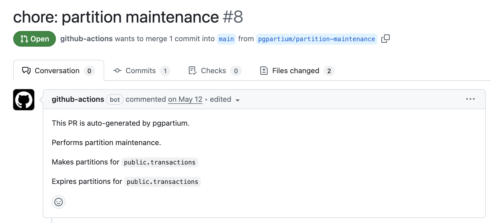

# pgpartium

[](https://github.com/bolajiwahab/pgpartium/actions/workflows/ci.yaml)
[](https://github.com/bolajiwahab/pgpartium/actions/workflows/release.yaml)

**pgpartium** is a tool that helps in managing the creation and expiration of partitions of a PostgreSQL partitioned table. It does this through the generation of migration files for partitions that would be created or dropped.

## Features

- Partition creation and expiration
- Time-based range partitioning
- Partition name templating
- Partition schema
- Partition tablespace
- Index tablespace
- Constraints, indexes, and triggers definitions replication from a template table
- Highly configurable
- PostgreSQL 14+ supported
- Migration files generation
- Migration file name templating
- Pull Requests creation with github action

## Getting Started

**pgpartium** is packaged as a docker [image](https://github.com/bolajiwahab/pgpartium/pkgs/container/pgpartium). The image contains the following utilities:

- **pgp-start**: Installs a major PostgreSQL version, optionally initializes a cluster and starts the cluster
- **pgp-make-partitions**: Generates partition migration files according to the configuration
- **pgp-expire-partitions**: Expire partitions according to the configuration
- **gh-create-pr**: Creates a pull request on github with generated migration files

## Installation

```bash
docker pull ghcr.io/bolajiwahab/pgpartium:0.5.0
```

**<span style="color:red">pgpartium is only supported on PostgreSQL 14 or higher</span>**.

## Usage

**pgp-make-partitions** and **pgp-expire-partitions** are typically used together, but can also be run independently. Both require that the database schema is already in place before execution.

Schema management is outside the scope of this tool and can be handled using any approach that fits your environment.

In all cases, **pgp-start** must be executed first, whether you are using cluster mode or an external database. It is responsible for preparing the runtime environment required for all subsequent operations.

When using cluster mode, schema initialization can be provided via the initdir, where you may run shell scripts, SQL files, or any migration tooling of your choice. When using an external database, schema setup is handled outside the tool.

When using an external database, you must then provide your database connection details (host, database, username, password) to run either pgp-make-partitions or pgp-expire-partitions.

In all cases, the requirement is the same: **pgp-start must run first, and the schema must already exist before partition operations are executed**.

For simple usage, run the following command:

```bash
docker run -it --user root --rm --volume "$PWD:/repository" ghcr.io/bolajiwahab/pgpartium:0.5.0 \
    sh -c 'pgp-start -v 17 -i /repository/migrations/initdir && \
    pgp-make-partitions -c /repository/partition_config.yaml && \
    pgp-expire-partitions -c /repository/partition_config.yaml'
```

The above command mounts the current directory into the container. Inside the container, it starts Postgres 17, applies the files in the initialization directory, and then generates migration files to create and expire partitions based on the settings in `partition_config.yaml`. Ensure that the migration directory specified in the partition configuration file matches the mounted directory, in this case `/repository/migrations`. Migration files are then generated in the `/repository/migrations` directory in the container which is mapped to the current directory on the host.

## Github Workflow

Here is a sample gihub workflow that leverages github actions dispatch and scheduling to generate migration files for partition creation and expiration, as well as creating or updating a pull request on github with the generated migration files:

```yaml
---
name: Partition Maintenance

on:
  workflow_dispatch:
  schedule:
    - cron: "30 16 * * 1-5"

permissions:
  pull-requests: write
  packages: read
  contents: write

jobs:
  partition_maintenance:
    name: Run Partition Maintenance
    runs-on: ubuntu-latest
    container:
      image: ghcr.io/bolajiwahab/pgpartium:0.5.0
      options: --user root
    steps:
      - name: Start PostgreSQL and apply init directory
        run: pgp-start -v 17 -i /repository/migrations/initdir

      - name: Checkout repository
        uses: actions/checkout@v3

      - name: Make partitions
        run: pgp-make-partitions -c partition_config.yaml

      - name: Expire partitions
        run: pgp-expire-partitions -c partition_config.yaml

      - name: Create Pull Request
        run: |
          gh-create-pr
        env:
          GH_TOKEN: ${{ github.token }}
```



## Configuration

**pgpartium** expects configuration in form of yaml. For the complete list of configuration options, see [configuration](https://bolajiwahab.github.io/pgpartium/schema.html). For a quick start, see [sample](config.sample.yaml).

Table-level configuration supersedes the global configuration but one of them must be specified for non-default configuration options.

## Binaries

### pgp-start

Installs a major PostgreSQL version along with psql client, optionally initializes a cluster and starts the cluster.

By default, it creates a cluster with `pg_createcluster` and starts the cluster.

```bash
pgp-start

Installs major PostgreSQL version, psql client, optionally creates a cluster, starts the cluster and applies init directory if provided.

OPTIONS:
  -v  the postgres version to use (Required)
  -i  the init directory to apply (Optional) (supports .sh, .sql and .sql.gz)
  -h  show this help message.

SAMPLE USAGE:
    pgp-start -v 17 -i initdir
    PGP_PG_MAJOR_VERSION=17 PGP_INIT_DIR=initdir pgp-start
```

To skip initializing a cluster, use

```bash
NO_CLUSTER=1 pgp-start -v 17
```

Note that when skipping the cluster initialization, you must provide the database connection details to run either pgp-make-partitions or pgp-expire-partitions, with the database schema already in place.

### pgp-make-partitions

Creates migration files to create partitions for partitioned tables. It requires the config file in yaml. It also supports passing the connection details to the database to use if you are not using the default database created by **pgp-start**.

```bash
pgp-make-partitions

Creates migration files to create partitions for partitioned tables.

OPTIONS:
  -c  the config file in yaml (Required)
  -u  the database username (Default: postgres)
  -w  the database password (Default: postgres)
  -s  the database host (Default: localhost)
  -p  the database port (Default: 5432)
  -d  the database name (Default: postgres)
  -h  show this help message.

SAMPLE USAGE:
    pgp-make-partitions -c config.yaml
    pgp-make-partitions -c config.yaml -u user -w password -s host -p port -d database
```

### pgp-expire-partitions

Creates migration files to expire partitions for partitioned tables. It requires the config file in yaml. It also supports passing the connection details to the database to use if you are not using the default database created by **pgp-start**.

```bash
pgp-expire-partitions

Creates migration files to expire partitions for partitioned tables.

OPTIONS:
  -c  the config file in yaml (Required)
  -u  the database username (Default: postgres)
  -w  the database password (Default: postgres)
  -s  the database host (Default: localhost)
  -p  the database port (Default: 5432)
  -d  the database name (Default: postgres)
  -h  show this help message.

SAMPLE USAGE:
    pgp-expire-partitions -c config.yaml
    pgp-expire-partitions -c config.yaml -u user -w password -s host -p port -d database
```

## gh-create-pr

A helper script to creates or updates a pull request on github with the migration files generated by **pgp-make-partitions** and **pgp-expire-partitions**. This should usually be used in github actions to create a pull request.

```bash
gh-create-pr

Creates or updates a pull request on github.

OPTIONS:
  -b  the branch name to use (Default: partition-maintenance)
  -t  the title of the pull request (Default: chore: partition maintenance)
  -m  the commit message (Default: chore: partition maintenance)
  -h  show this help message.

SAMPLE USAGE:
    gh-create-pr -b generate-partitions
```

## Contributing

We welcome and greatly appreciate contributions. If you would like to contribute, please see the [contributing guidelines](docs/docs/contributing.md).

## Support

Encountering issues? Take a look at the existing GitHub [issues](https://github.com/bolajiwahab/pgpartium/issues), and don't hesitate to open a new one.

## License

MIT license.
